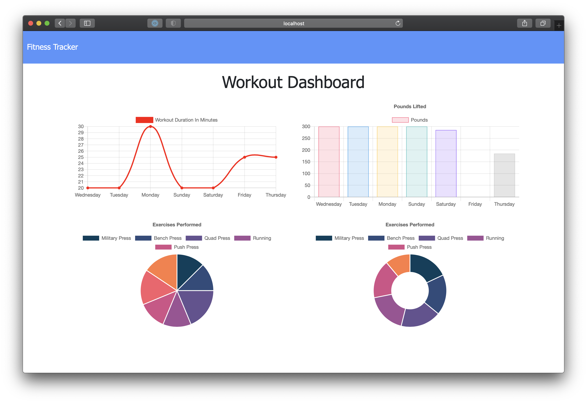

# My Fitness Tracker

## <h2>Description</h2>

This is a Node application that utilizes Express, Mongoose and is deployed to Heroku and utilizes a MongoDB Atlas database. Create workouts, and track weekly minutes exercised and weight lifted via MongoDB aggregators.

## <h2 id="">Table of Contents</h2>

- <a href="#installation">Installation Instructions</a>
- <a href="#usage">Product Usage</a>
- <a href="#license">Product Licensing</a>
- <a href="#contributing">How to Contribute</a>
- <a href="#tests">How to Test</a>
- <a href="#questions">Frequently Asked Questions (FAQ)</a>

## <h2 id="installation">Installation</h2>

This app is available here - https://intense-meadow-04152.herokuapp.com/

## <h2 id="usage">Usage</h2>

N/A

## <h2 id="license">License</h2>

## <h2 id="contributing">Contributing</h2>

N/A

## <h2 id="tests">Tests</h2>

N/A

# <h2 id="questions">Questions? Reach out to me directly!</h2>

<a href="https://www.github.com/mknowlton89">My GitHub</a>

<a href="mailto:mknowlton89@gmail.com">Send me an email! (No spam, please)<a/>